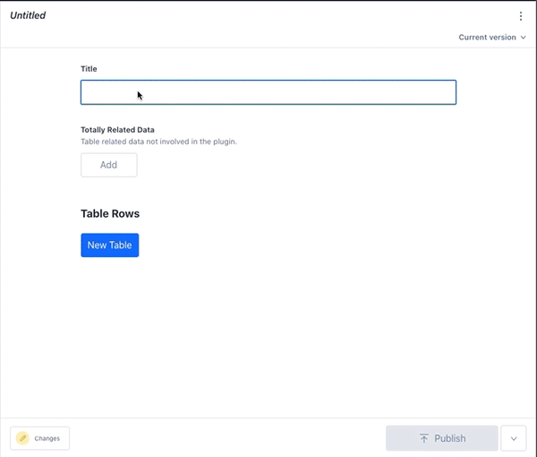

# sanity-plugin-byo-table

[Sanity](https://www.sanity.io/) plugin that supplies the react editor for a user defined table and row. Basically, bring your own schema.



This repo is forked from [sanity-plugin-table](https://www.github.com/rdunk/sanity-plugin-table)

## Getting started

1. Install using the [Sanity CLI](https://www.sanity.io/docs/cli).

```
sanity install @ssfbank/sanity-plugin-byo-table
```

2. Define your table schema

Start with the cell level of the table, which should be an object.
The name of this cell object can be anything.

```javascript
export default {
    title: 'Table Cell',
    name: 'cell',
    type: 'object',
    fields: [
        {
            name: 'value',
            title: 'The value',
            type: 'string'
        },
        {
            name: 'anotherValue',
            title: 'More value',
            type: 'number'
        }
    ],
    preview: {
        select: {
            title: 'value',
            subtitle: 'anotherValue'
        }
    }
};
```

Define the row level. This is restricted to have only one field and that should be an array of the cell object.
The name of this table row object can be anything.

```javascript
export default {
  title: 'Table Row',
  name: 'row',
  type: 'object',
  fields: [
    {
        name: 'cells',
        type: 'array',
        of: [{ type: 'cell' }]
    }
  ]
};
```

The actual document(or object) where you want a table should have a field of type array of the row object. It also needs to have input component RowsInput.

```javascript
import RowsInput from 'part:@ssfbank/sanity-plugin-byo-table/rows-input';

export default {
  title: 'Table',
  name: 'table',
  type: 'document',
  fields: [
    {
      name: 'title',
      type: 'string',
      title: 'Title'
    },
    {
      name: 'totallyRelatedData',
      type: 'array',
      description: 'Table related data not involved in the plugin.',
      of: [
        {
          type: 'string',
        }
      ]
    },
    {
      name: 'rows',
      title: 'Table Rows',
      type: 'array',
      of: [
        {
          type: 'row',
        }
      ],
      inputComponent: RowsInput
    }
  ],
  preview: {
    select: {
      title: 'title'
    }
  }
};
```

Finally, register these types in the schema:

```javascript
import cell from './example-schema/cell';
import row from './example-schema/row';
import table from './example-schema/table';

const tableTypes = [cell, row, table];

const allSchemaTypes = schemaTypes
  .concat(tableTypes);
export default createSchema({
  name: 'default',
  types: allSchemaTypes,
});
```

These examples are attached under /example-schema

## Known Issues

- Performance is weak in general and seems to scale negatively with amount of cells. PRs welcome.
- Block content works in cells, but object marks in the blocks(like links, urls etc) can not be edited as the popover is not visible. This may be a sanity bug, PRs welcome.
- Only tested on chrome, so quite possible some quirks on other browsers.
- There is no horizontal scroll styling, so alot of columns will look kind of rubbish.

## Migrating from sanity-plugin-table

If coming from the original fork and wanting to switch to this plugin,
you can do it without migrating. Just install this plugin, remove the old one, copy in the schema and point the RowsInput-component to the 'rows' field.

## License

[MIT](http://opensource.org/licenses/MIT)
